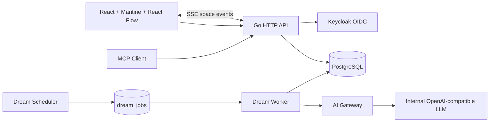

# Architecture



Go 프로세스 하나가 정적 UI, REST, MCP, OIDC callback, Dream Scheduler/Worker를 함께 제공합니다. 외부 broker 없이 PostgreSQL의 `FOR UPDATE SKIP LOCKED`로 Dream job을 claim하므로 단일 이미지로 시작할 수 있고 여러 replica에서도 같은 job을 중복 claim하지 않습니다.

## 데이터 경계

- Canvas: `spaces`, `notes`, `note_edges`
- Intelligence: `note_embeddings`, `note_revisions`
- Collaboration: `space_members`, `space_events`, `notifications`
- Identity: `users`, `sessions`, `oauth_states`, `teams`
- Personalization: `user_preferences`, `api_keys`
- Governance: `approval_requests`, `audit_logs`, `app_settings`
- Dream: `dream_jobs`, `dream_notes`, `dream_sources`, `dream_feedback`, `ai_calls`

UI와 API의 optimistic concurrency는 `notes.version`으로 충돌을 감지합니다. 삭제는 `deleted_at`을 사용하는 soft delete이며 공간/사용자 제거 같은 관리적 cascade는 PostgreSQL foreign key로 제한합니다.

연관 생각과 Cluster는 192차원 문자 n-gram feature hashing과 cosine similarity로 계산합니다. 모델 파일이나 외부 임베딩 호출이 없어 오프라인 기본 기능으로 유지되며, 사용자가 요청할 때만 배치를 제안합니다. 공간 변경은 PostgreSQL에 단조 증가 event로 기록하고 브라우저에 SSE로 전달합니다. 네트워크 재연결 후 Canvas를 다시 읽으므로 별도 메시지 broker 없이 일관성을 회복합니다.

## Dream 흐름

```text
Scheduler → Eligibility → DB Queue → Context selection/redaction
          → AI Gateway → Quality score → Dream Note + source edges
          → Morning Discovery → implicit feedback
```

AI 호출 전 password, secret, token, API key 형태를 제거합니다. AI가 비활성화되었거나 내부 Gateway가 없으면 일반 메모·Related·Cluster 기능에는 영향이 없습니다. 낮은 품질은 1회 재생성 후에도 기준 미달이면 사용자 노출 없이 skip 처리합니다. Dream 편집·연결·발전·삭제 행동은 사용자별 유형 선호도에 반영됩니다.
