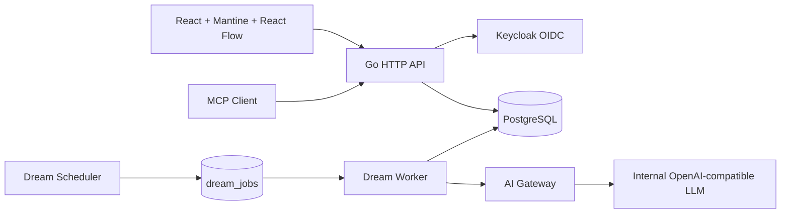

# Architecture



Go 프로세스 하나가 정적 UI, REST, MCP, OIDC callback, Dream Scheduler/Worker를 함께 제공합니다. 외부 broker 없이 PostgreSQL의 `FOR UPDATE SKIP LOCKED`로 Dream job을 claim하므로 단일 이미지로 시작할 수 있고 여러 replica에서도 같은 job을 중복 claim하지 않습니다.

## 데이터 경계

- Canvas: `spaces`, `notes`, `note_edges`
- Identity: `users`, `sessions`, `oauth_states`, `teams`
- Personalization: `user_preferences`, `api_keys`
- Governance: `approval_requests`, `audit_logs`, `app_settings`
- Dream: `dream_jobs`, `dream_notes`, `dream_sources`, `dream_feedback`, `ai_calls`

UI와 API의 optimistic concurrency는 `notes.version`으로 충돌을 감지합니다. 삭제는 `deleted_at`을 사용하는 soft delete이며 공간/사용자 제거 같은 관리적 cascade는 PostgreSQL foreign key로 제한합니다.

## Dream 흐름

```text
Scheduler → Eligibility → DB Queue → Context selection/redaction
          → AI Gateway → Quality score → Dream Note + source edges
          → Morning Discovery → implicit feedback
```

AI 호출 전 password, secret, token, API key 형태를 제거합니다. AI가 비활성화되었거나 내부 Gateway가 없으면 일반 메모 기능에는 영향이 없습니다. 낮은 품질은 한 번의 사용자 노출도 없이 skip 처리합니다.
