# umm 사용자 가이드

기준 버전 **v0.71.6**. 화면을 띄워 놓고 지키는 사람을 위한 안내는 [관리자 가이드](ADMIN_GUIDE.md)에 있습니다.
이 문서의 화면은 모두 v0.71.6 을 실제로 띄워 `1440x900` 에서 찍은 것이며, 데이터는 가짜입니다.

## 1. 이 제품이 하는 일

`umm`은 생각을 문서나 폴더로 정리하기 **전에** 붙여 두는 곳입니다. 무한 캔버스 위에 포스트잇처럼 생각을 놓고,
선으로 잇고, 색과 갈래로 구분합니다. 정리는 나중에 해도 되고, 안 해도 됩니다 — 위치와 연결 자체가 그 생각을
기억하는 방식입니다.

혼자 쓰는 메모장이 아니라 팀이 함께 쓰는 공간입니다. 공간을 팀원과 공유하면 같은 캔버스를 동시에 보고,
댓글과 `@멘션`으로 의견을 주고받습니다. 밤사이 **Dream**이 낮에 붙인 생각 사이의 연결을 제안하고, 아침의
**오늘의 리뷰**가 다시 볼 생각을 골라 줍니다(Dream 은 관리자가 AI Gateway 를 붙였을 때만 옵니다).

기획·연구·의사결정처럼 "무엇을 왜 정했는지"가 남아야 하는 일에 맞습니다. 접어 둔 선택은 이유와 함께 남고,
캔버스는 그대로 발표 자료나 Markdown 문서가 됩니다.

## 2. 처음 5분

로그인부터 첫 연결까지 한 번에 따라 합니다.

### 2-1. 로그인

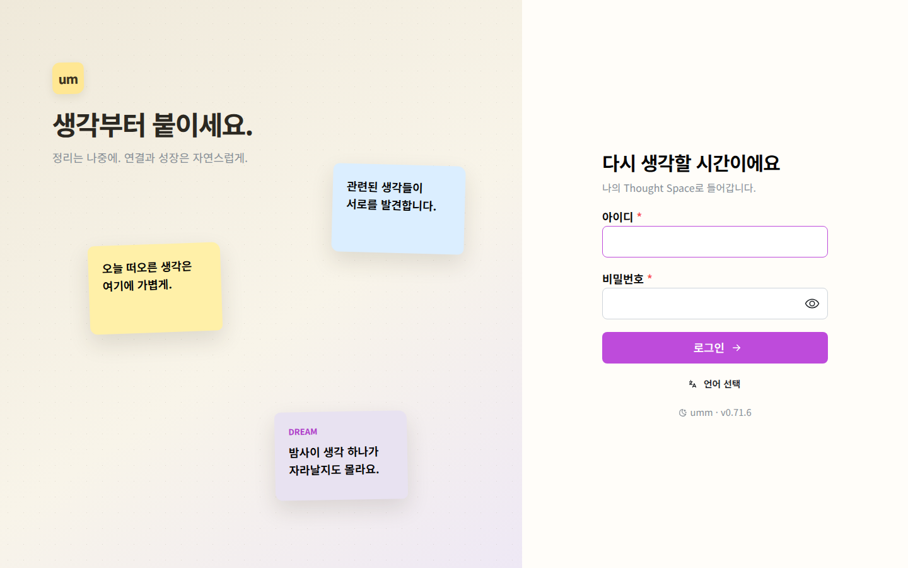

1. 관리자에게 받은 아이디와 비밀번호를 넣고 **로그인**을 누릅니다.
2. 사내 SSO(Keycloak)가 연동된 설치라면 **Keycloak SSO로 계속** 단추로 들어갑니다. 계정은 첫 로그인 때 자동으로 만들어집니다.
3. 아이디·비밀번호가 틀리면 *"아이디 또는 비밀번호가 올바르지 않습니다."* 가 뜹니다. 같은 자리에서 여러 번
   실패하면 잠시 잠깁니다(기본 8회, 15분) — 기다렸다가 다시 하세요.

### 2-2. 오늘의 리뷰에서 시작

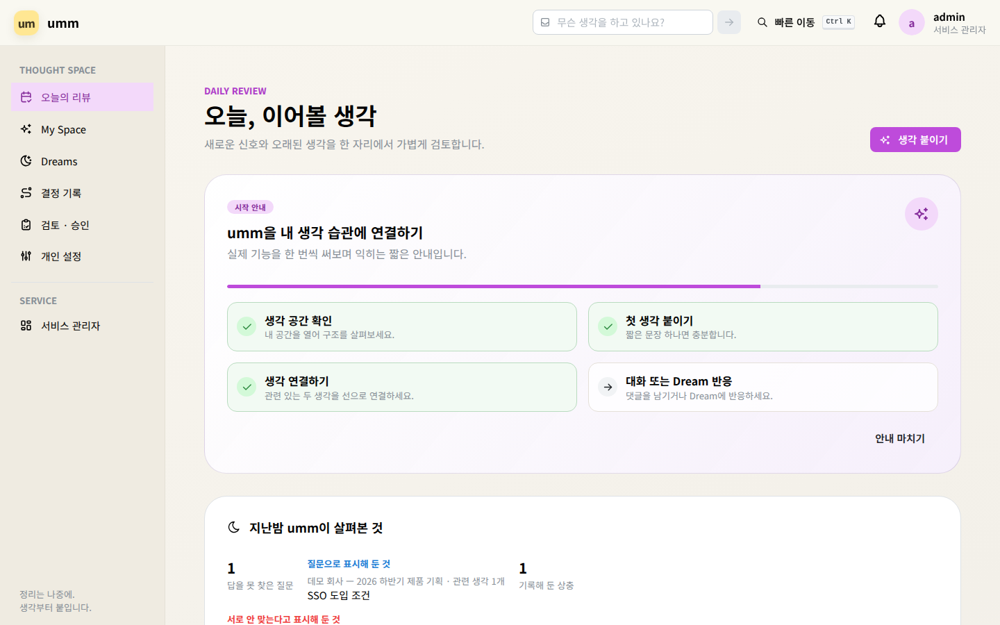

로그인하면 **오늘의 리뷰**(`/today`)가 열립니다. 처음에는 **시작 안내** 카드가 4단계를 안내합니다 — 공간 확인,
첫 생각, 첫 연결, 댓글 또는 Dream 반응. 실제로 한 일에 따라 자동으로 체크됩니다.

### 2-3. 첫 생각 붙이기

왼쪽 메뉴 **My Space** 를 누르면 캔버스가 열립니다.

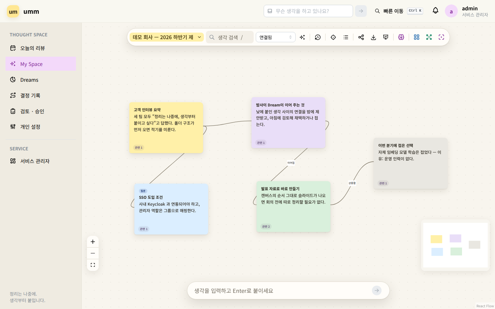

가장 빠른 길은 화면 아래 입력창입니다. **"생각을 입력하고 Enter로 붙이세요"** 에 한 문장을 적고 Enter 를
누르면 화면 가운데에 붙습니다. 다른 방법도 있습니다.

| 방법 | 하는 일 |
| :--- | :--- |
| 캔버스 빈 곳 **더블클릭** | 그 자리에 빈 포스트잇 |
| 단축키 `N` | 아래 입력창으로 포커스 |
| 화면 맨 위 **"무슨 생각을 하고 있나요?"** | 어느 화면에서든 수집함에 담기 |

포스트잇을 클릭해 제목과 본문을 씁니다. 저장 단추는 없습니다 — 멈추면 저장됩니다.

### 2-4. 첫 연결

포스트잇 가장자리의 동그란 손잡이를 끌어 다른 포스트잇에 놓으면 선이 그어집니다. 도구 모음의 **연결됨**
드롭다운이 새로 긋는 선의 종류입니다(연결됨 · 이어짐 · 상충됨 등). 여기까지 하면 시작 안내의 세 칸이 채워집니다.

## 3. 화면별 사용법

### 3-1. 오늘의 리뷰 (`/today`)

위 그림이 그 화면입니다. 하는 일:

- **지난밤 umm이 살펴본 것** — 답을 못 찾은 질문, 기록해 둔 상충, 접어 둔 갈래를 다시 쓰고 있는지.
- **검토 카드** — `완료`를 누르면 지금 시각이 기록되고, `다시 보기`는 고른 날짜까지 목록에서 미룹니다.
  검토 상태는 사람마다 따로라서 공유 생각을 완료해도 다른 사람 목록은 그대로입니다.
- **내 기억에 물어보기** — 위쪽 입력란. 직접 적어 둔 생각만 근거로 답하고, 근거가 없으면 모델을 부르지
  않습니다. `살펴보고 답하기`는 찾아보고·읽고·다시 찾아본 뒤 답하며 어디를 봤는지 보여 줍니다. 채팅 모델이
  설정된 설치에서만 동작합니다.
- **생각 붙이기** 단추 — 캔버스로 갑니다.

### 3-2. 캔버스 (`/space/<공간>`)

도구 모음(왼쪽부터): 공간 이름 · 생각 검색(`/`) · 새 연결 종류 · 연결 추천 받기 · **격자에 맞추기** · 되감기 ·
한 갈래만 보기 · 생각 선형 목록 · 공간 공유 · 내보내기 · 이 공간을 발표 자료로 · AI 생각 도구 · 겹침 정리 ·
생각 군집 · 캔버스 맞춤.

**보던 자리** — 공간을 나갔다 돌아오면 **마지막으로 보던 위치와 배율**로 돌아옵니다. 처음 여는 공간만 전체를
맞춰 보여 줍니다. 되감기 중에는 적용하지 않습니다 — 과거는 과거대로 잡아 줍니다.

**격자에 맞추기** — 켜면 생각을 끌 때 격자에 붙어 줄이 맞습니다. **기본은 꺼져 있습니다**: 정리는 나중에 하고
생각부터 붙이는 것이 이 제품의 태도라, 늘 붙잡는 격자는 그 태도와 다툽니다. 켜져 있을 때만 격자 점이 보이므로
**보이는 점이 곧 붙는 자리**입니다. 선택은 기억됩니다.

**공간** — 공간 이름 단추를 누르면 목록이 열리고 검색·새 공간 만들기·공간 관리가 있습니다. 공간은 프로젝트나
주제별 독립 캔버스입니다.

**포스트잇 메뉴** — 포스트잇 오른쪽 위 `⋯`(메모 메뉴)에 그 생각으로 할 수 있는 일이 모여 있습니다.

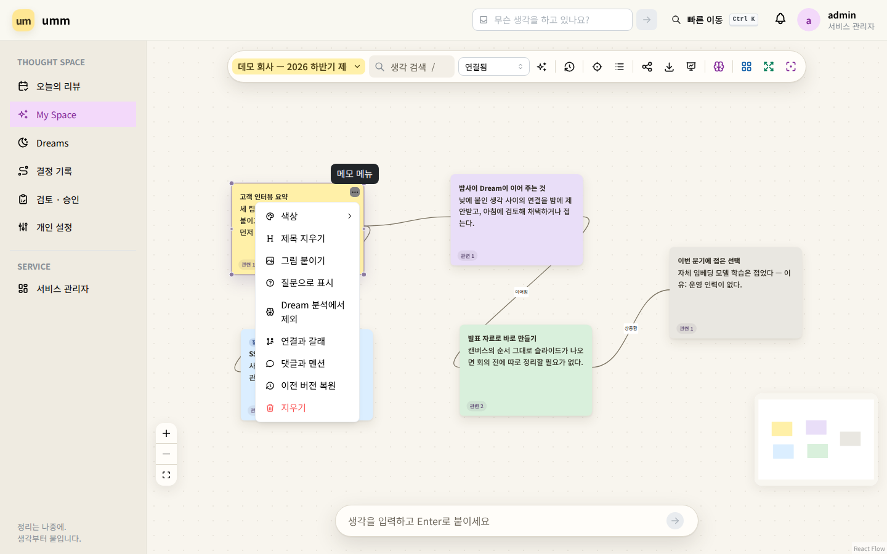

| 항목 | 하는 일 |
| :--- | :--- |
| 색상 | 노랑·파랑·보라·라벤더·초록·빨강·회색 |
| 그림 붙이기 | PNG·JPEG·GIF·WebP, 한 장 5MB, 생각당 8장. 파일 내용으로 판정하므로 확장자를 바꿔도 소용없고 SVG 는 받지 않습니다 |
| 질문으로 표시 | 답을 기다리는 생각으로 표시. 오늘의 리뷰가 답 못 찾은 질문으로 셉니다 |
| Dream 분석에서 제외 | 이 생각은 Dream·AI 도구·검색 임베딩 어디로도 나가지 않습니다 |
| 연결과 갈래 | 직접 연결·백링크 목록, 각 연결에 **왜 이었는지 적기**, 갈래 만들기·넣기·정리 |
| 댓글과 멘션 | 4,000자 댓글. `@아이디`로 언급하면 알림이 그 댓글로 연결됩니다 |
| 이전 버전 복원 | 바뀌기 전 판본으로 되돌립니다 |
| 지우기 | 붙인 그림도 함께 사라집니다 |

**공유** — 도구 모음의 **공간 공유**를 누르면 **이 공간 함께 쓰기** 창이 열립니다. 사용자 아이디를 넣고 권한을 골라 **초대**합니다. 아래 목록이 지금 함께 쓰는 사람과 그 권한입니다.

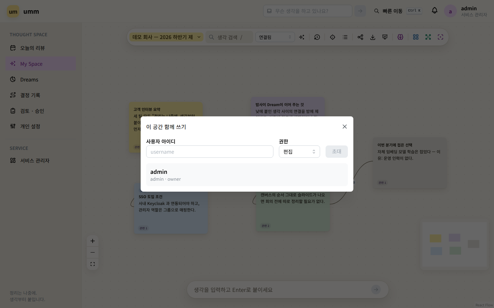

| 권한 | 할 수 있는 일 |
| :--- | :--- |
| 보기 | 읽기 전용. **댓글은 쓸 수 있습니다** — 의견만 받을 때 편집을 줄 필요가 없습니다 |
| 편집 | 생각·연결·갈래 수정 |
| 관리 | 위에 더해 공유 관리 |

**되감기** — 도구 모음의 시계 단추. `하루 전 · 일주일 전 · 한 달 전 · 석 달 전` 중 고르면 그때의 캔버스(생각·연결·그 시점까지의 그림)를 읽기 전용으로
봅니다. 위쪽 배너가 그 사실과, 그때는 있었지만 지금은 그릴 수 없는 것의 개수를 말해 줍니다. **지금으로**를
누르면 돌아옵니다. 되감은 동안 편집하려 하면 *"지나간 시점을 보고 있어 바꿀 수 없습니다. 지금으로 돌아오면 다시 씁니다."* 가 뜹니다.

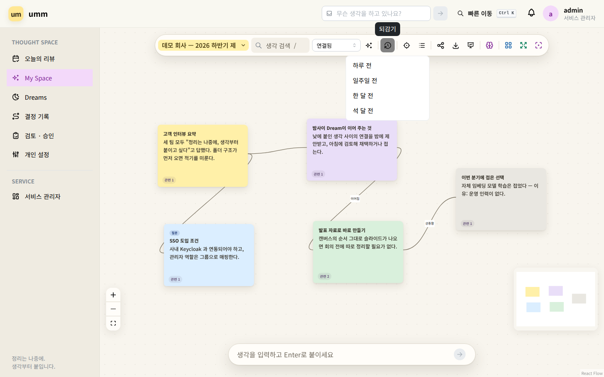

**정렬 세 가지** — 셋 다 `Ctrl+Z` 한 번으로 되돌아갑니다.

| 도구 | 하는 일 | 건드리지 않는 것 |
| :--- | :--- | :--- |
| 겹침 정리 | 겹친 것만 최소 거리로 떼어 놓습니다 | 여유가 있는 생각은 한 개도 옮기지 않습니다 |
| 생각 군집 | 묶음별로 나란히 정렬 | 어느 묶음에도 없는 생각 |
| Thought Gravity | 고른 생각의 직접 연결된 것들을 둘레에 모읍니다 | 나머지 |

**한 갈래만 보기(초점)** — 고른 갈래만 선명하고 나머지는 흐려집니다. 숨기지는 않으며 몇 개를 흐리게 뒀는지
항상 함께 말합니다. 생각을 하나 고른 상태면 연결 1~3걸음으로도 좁힐 수 있습니다.

**AI 생각 도구** — 생각을 고른 뒤 도구 모음의 뇌 모양 단추.

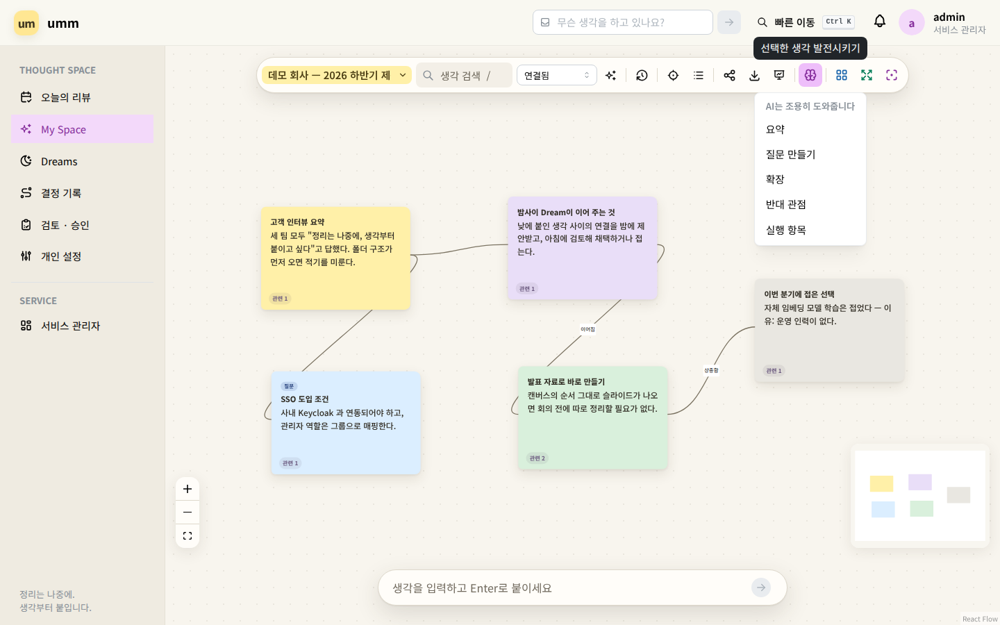

| 도구 | 하는 일 |
| :--- | :--- |
| 요약 | 고른 생각들의 결론을 한 문장으로 |
| 질문 만들기 | 놓치고 있는 검토 질문 |
| 확장 | 새 적용 분야·아이디어 |
| 반대 관점 | 반론과 리스크 |
| 실행 항목 | 당장 할 일 목록 |

결과가 마음에 들면 `새 생각으로 붙이기`로 캔버스에 올립니다. 관리자가 AI Gateway 를 붙이지 않은 설치에서는
단추가 있어도 동작하지 않습니다. `Dream 분석에서 제외`한 생각은 골라도 보내지지 않습니다.

**생각 선형 목록** — 위치와 무관하게 순서대로 읽는 접근성 보기입니다. 마우스 없이도 `Tab`으로 포스트잇을
옮겨 다니고 `Enter`로 편집, `Esc`로 나온 뒤 방향키로 자리를 잡습니다.

#### 캔버스 단축키

| 단축키 | 기능 |
| :--- | :--- |
| 더블클릭 | 그 자리에 새 생각 |
| `N` | 아래 입력창으로 |
| `/` · `Cmd/Ctrl+F` | 생각 검색 |
| `F` | 모든 생각이 보이게 맞춤 |
| `Cmd/Ctrl+A` | 전체 선택 |
| `Delete` / `Backspace` | 선택한 생각 지우기 |
| `Cmd/Ctrl+Z` · `Shift+Cmd/Ctrl+Z` | 위치·정렬 되돌리기 · 다시 |
| `Tab` · `Enter` · `Esc` | 다음 생각 · 편집 시작 · 편집 끝/선택 해제 |
| 방향키 | 5px 이동 (`Shift` 와 함께 20px) |
| `Ctrl+K` | 빠른 이동 (어느 화면에서든) |

### 3-3. Dreams (`/dreams`)

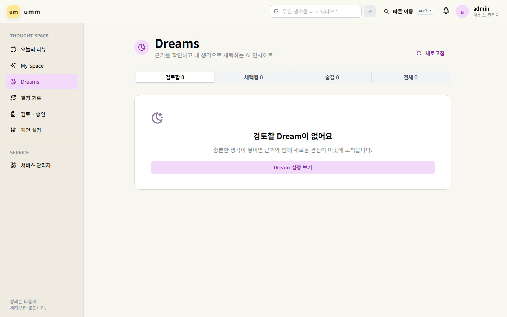

밤사이 만들어진 후보를 검토하는 곳입니다. 후보는 캔버스에 아직 없습니다.

- `왜 이 Dream인가요?` 와 원본 생각 카드를 확인합니다. 원본을 누르면 그 생각으로 갑니다.
- **캔버스에 남기기** — Dream 생각과 원본으로 가는 연결선이 함께 생깁니다.
- **다른 관점** — 같은 원본으로 다른 결론을 요청합니다. **발전시키기** — 더 구체화·반대 관점·실행 항목.
- 숨기며 이유를 고르면(뻔함·관련 없음·사실 오류·반복) 이후 스타일에 반영됩니다. `너무 자주 와요`는 빈도를
  `매일 → 주 3회 → 주 1회`로 낮춥니다.

이 문서를 찍은 설치에는 AI Gateway 가 없어 **후보가 있는 상태의 화면은 싣지 못했습니다.** 후보가 오려면
관리자가 AI Gateway 와 Dream 자동 생성을 켜야 합니다.

### 3-4. 결정 기록 (`/decisions`)

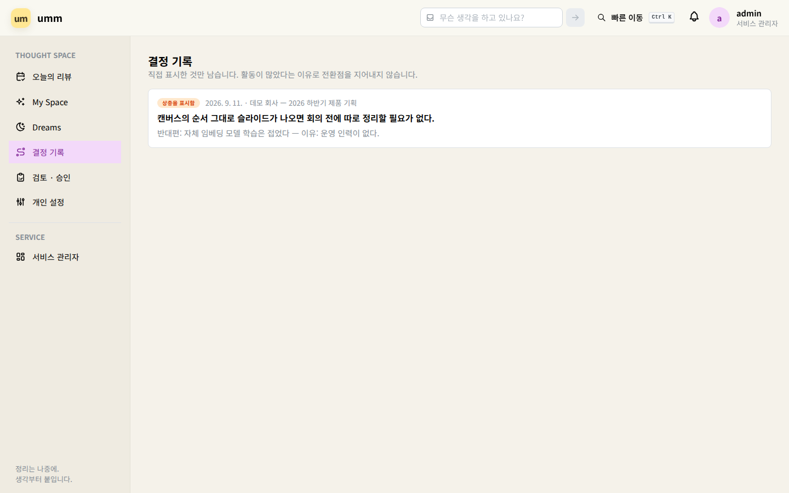

갈래 채택·접어 둠, 질문에 답 표시, 상충 표시처럼 **사람이 표시한 것만** 모읍니다. 활동이 많았다는 이유로
전환점을 지어내지 않으며, 비어 있으면 *"표시된 것이 없다는 뜻이지, 아무 일도 없었다는 뜻은 아닙니다"*라고
말합니다.

### 3-5. 검토 · 승인 (`/approvals`)

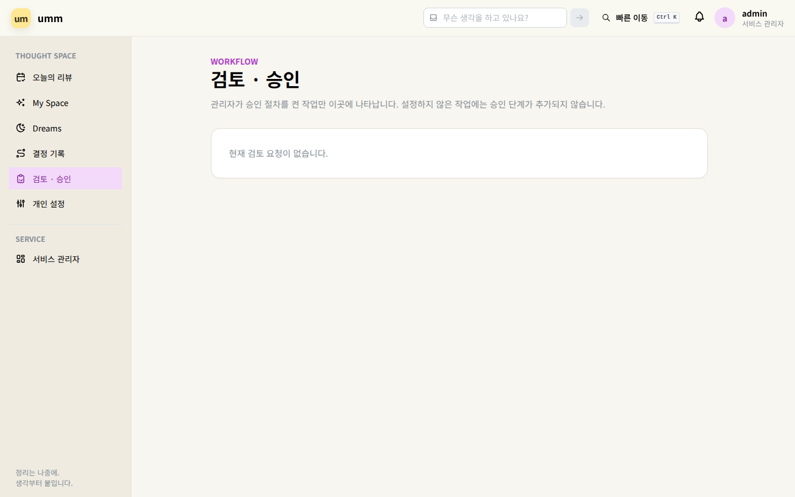

관리자가 **검토 프로세스**에서 승인을 켜 둔 작업(공간 공유, 외부 내보내기 등)은 여기서 팀장 또는 관리자가
승인합니다. 켜져 있지 않으면 이 단계는 생기지 않습니다. 자기 요청이나 다른 팀의 요청은 검토할 수 없습니다.

### 3-6. 개인 설정 (`/settings`)

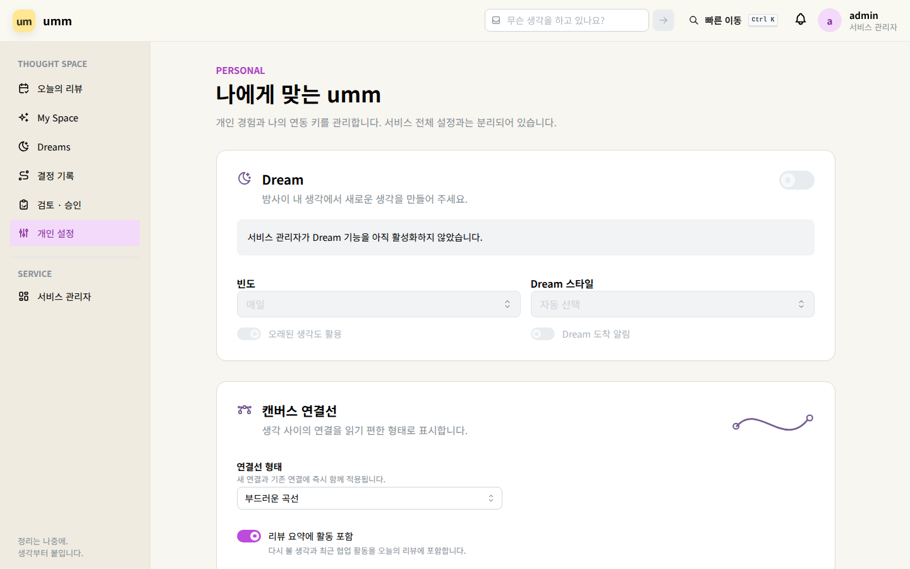

- **Dream 설정** — 켜고 끄기, 도착 알림, 생성 주기, 스타일 선호.
- **연결선 형태** — 베지어 곡선 / 둥근 꺾은선 / 직선.
- **내 AI 사용 내역** — 내 생각이 언제 무엇을 위해 모델로 갔는지. 실패한 호출도 나옵니다. 검색·연결용
  임베딩은 여러 사람 것이 묶여 나가 개인별로 셀 수 없어 목록에 없고, 대신 이 설치가 본문을 밖으로 보내는지
  아닌지를 목록 위에 적어 둡니다.
- **로그인한 기기** — 모르는 기기가 보이면 종료하고 비밀번호를 바꾸세요.
- **언어와 테마** — 오른쪽 위 프로필 메뉴. 한국어/English, 밝게/어둡게/시스템. 계정에 저장됩니다.
- **API · MCP 키** — 아래 4-6 참고.

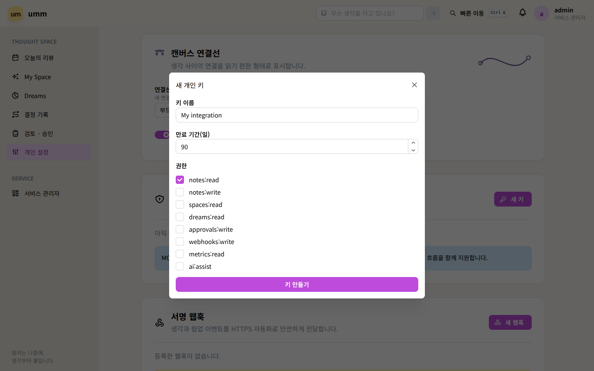

## 4. 자주 하는 작업

### 4-1. 회의 전에 캔버스를 발표 자료로 만들기

도구 모음의 **이 공간을 발표 자료로**를 누르면 **발표로 만들기** 창이 열립니다.

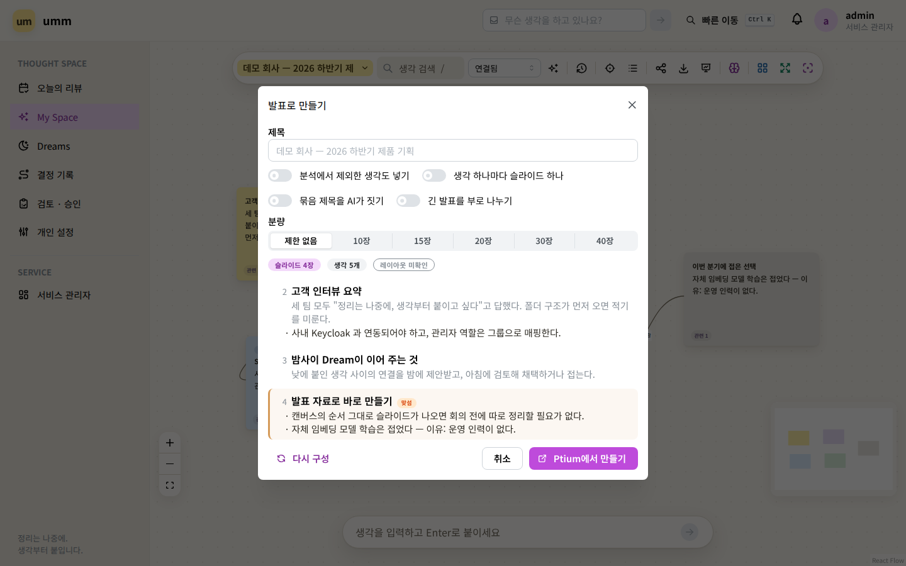

- **제목**을 비우면 공간 이름이 덱 이름과 표지가 됩니다.
- 옵션 네 가지: `분석에서 제외한 생각도 넣기` · `생각 하나마다 슬라이드 하나` · `묶음 제목을 AI가 짓기` · `긴 발표를 부로 나누기`. 뒤의 둘은 관리자가 채팅 모델을 설정했을 때만 무언가를 합니다.
- 미리보기의 `맞섬` 배지는 상충 연결로 이은 두 생각이 한 슬라이드가 된다는 뜻이고, 그 연결에 적어 둔 이유가 함께 올라갑니다. **다시 구성**으로 새로 그리고 **Ptium에서 만들기**로 보냅니다.

- 순서는 `이어짐` 연결이거나 캔버스 배치이고, 문장은 쓴 그대로입니다. AI 는 제목 짓기·부 나누기
  옵션을 켰을 때만, 그것도 제목에만 관여합니다.
- **분량**을 고르면 무엇을 남길지 그래프가 정합니다 — 연결이 많이 닿은 생각, 표시한 상충. 같은 공간 + 같은
  분량 = 같은 덱이라 미리보기가 믿을 만합니다. 부 제목도 분량에 셉니다.
- 만들면 Ptium 에 덱이 생기고 슬라이드마다 출처 생각으로 돌아가는 번호가 붙습니다. 실패하면 화면이 무엇을
  할지 말해 줍니다(아래 5. 막혔을 때).

### 4-2. 백업 받기 · 되돌리기

도구 모음의 **내보내기**.

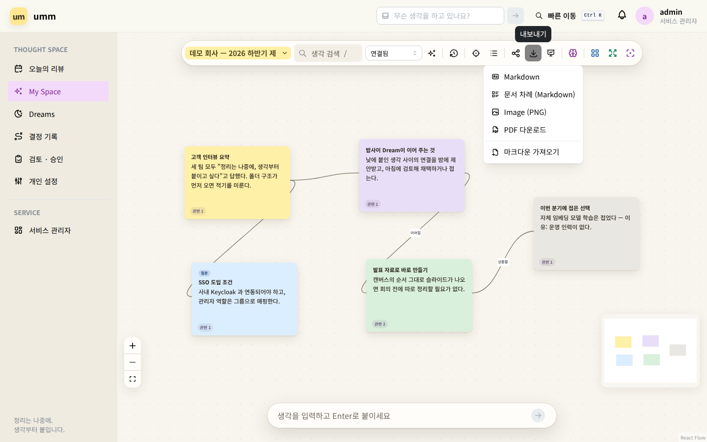

| 항목 | 무엇이 나가나 |
| :--- | :--- |
| Markdown | **백업.** 제목·본문·자리·색·갈래·연결(이유 포함)이 모두 실립니다. **붙인 그림은 실리지 않습니다** |
| 문서 차례 (Markdown) | 발표와 같은 순서의 글. id·좌표가 없어 바로 문서에 이어 씁니다 |
| Image (PNG) · PDF 다운로드 | 지금 캔버스를 배치 그대로 그림으로 |
| 마크다운 가져오기 | 반대 방향. umm 이 내보낸 파일은 공간 그대로 돌아옵니다 |

되돌릴 때는 같은 메뉴의 **마크다운 가져오기**에 파일을 고르거나 붙여 넣습니다. **파일을 나누지 마세요** —
첫머리의 `Exported from umm at …` 줄이 있는 조각만 umm 의 것으로 읽히고, 없는 조각은 평범한 마크다운이
되어 자리·연결·갈래가 사라집니다. 남의 마크다운은 한 번에 200개까지이고 `#` 제목·`---`·빈 줄로 나뉩니다.

### 4-3. 접어 둔 선택을 남기기 (갈래)

시도했다가 접은 생각은 검색에서 다시 만났을 때 현재 방침과 똑같이 생겼습니다. 갈래가 그걸 막습니다.

1. 메모 메뉴 → **연결과 갈래** → 갈래 이름을 적고 `만들기`.
2. 같은 패널에서 갈래 배지를 눌러 생각을 넣거나 뺍니다.
3. 갈래 메뉴 → `이 방향으로 정함` 또는 `접어 두기`. **이유는 필수입니다.**

접어 둔 갈래의 생각에는 캔버스·검색·질문·내보내기·MCP 어디서든 표시가 붙고, 거의 같은 생각을 새로 적으면
오늘의 리뷰가 *"접어 둔 갈래를 다시 쓰고 있습니다"*라고 이유와 함께 알려 줍니다.

### 4-4. 의견만 받기

공간 공유에서 **보기** 권한을 주세요. 읽기 전용이지만 댓글은 쓸 수 있고, `@아이디`로 부르면 알림이 그 댓글로
연결됩니다. 편집 권한이 있는 사람은 논의를 해결/다시 열 수 있고 작성자·공간 관리자는 지울 수 있습니다.

### 4-5. 오프라인에서 이어서 쓰기

네트워크가 끊겨도 생성·수정은 브라우저 큐에 쌓이고 위쪽 상태 표시에 대기 수가 보입니다. 다시 연결되면
자동으로 보내며 같은 생각의 연속 수정은 마지막 상태로 합쳐집니다. 서버에 더 새 판본이 있으면 덮어쓰지 않고
**비교 창**을 열어 내 것·서버 것·합친 것 중 고르게 합니다. 공용 PC 에서는 로그아웃 전에 동기화가 끝났는지
확인하세요. 모바일에서는 다른 앱의 공유 시트에 umm 이 나타나 기사나 메모를 빠른 입력창으로 보냅니다.

### 4-6. 자동화용 API · MCP 키 만들기

개인 설정 → **새 키**. 이름·만료·권한(스코프)을 고르고 `키 만들기`를 누르면 `umm_key_…` 토큰이 **한 번만**
보입니다. 안전한 곳에 복사하세요.

- 읽기만 하는 자동화는 `notes:read` 만. AI 도구를 부르는 자동화에만 `ai:assist` 를 더합니다.
- 발표 자료(덱)는 따로 된 권한이 없고 `notes:read`·`notes:write` 를 씁니다.
- 만료 전 **회전**을 누르면 중첩 시간(기본 24시간) 동안 옛 키와 새 키가 함께 살아 있습니다.
- 권한은 만든 뒤에도 켜고 끌 수 있지만, 권한이 하나도 없는 키는 둘 수 없습니다 — 안 쓸 키는 **폐기**하세요.
  폐기는 되돌릴 수 없습니다.

고를 수 있는 권한 목록은 관리자가 정합니다(키 · 권한 화면).

## 5. 막혔을 때

| 화면에 뜨는 말 | 무엇을 하면 되나 |
| :--- | :--- |
| 아이디 또는 비밀번호가 올바르지 않습니다. | 다시 입력. 여러 번 실패해 잠겼으면 기본 15분 뒤에 다시. 계속 안 되면 **관리자에게** 비밀번호 재설정을 요청 |
| 짧은 시간에 너무 많은 요청이 들어왔습니다. 잠시 후 다시 시도해 주세요. | 분당 요청 상한(기본 600) 또는 AI 상한(기본 분당 6, 하루 80)입니다. 잠시 뒤 다시. 한도를 올리는 것은 **관리자**의 일 |
| 공간 공유를 관리할 권한이 없습니다. | 공간의 `관리` 권한이 있는 사람이나 소유자에게 요청 |
| 소유한 공간만 삭제할 수 있습니다. | 소유자에게 요청 |
| 팀장 또는 관리자만 검토할 수 있습니다. / 자신의 요청 또는 다른 팀의 요청은 검토할 수 없습니다. | 검토 · 승인은 다른 팀장에게 넘깁니다 |
| 오프라인 저장 실패 | 브라우저 저장 공간이 찼거나 사이트 데이터가 차단된 상태. 저장되지 않은 편집은 마지막으로 보존된 내용으로 돌아갑니다. 권한·용량을 확인하고 연결을 복구한 뒤 다시 저장 |
| Ptium에 연결하지 못했습니다 / Ptium이 umm의 자격 증명을 거부했습니다 / 그 주소에 Ptium API가 없습니다 / Ptium 쪽에서 오류가 났습니다 | **관리자에게** 그대로 전달. Ptium 설정 문제입니다 |
| Ptium이 제때 답하지 않았습니다 | 생각이 많은 공간이면 그렇습니다. 분량을 줄여 다시, 또는 관리자에게 제한 시간 상향 요청 |
| Ptium이 이 발표 구성을 받아들이지 않았습니다 | 관리자 일이 아닙니다. 어느 슬라이드인지 알려 주므로 그 생각을 고쳐 다시 |
| Ptium에는 만들어졌지만 umm이 기록하지 못했습니다 | **다시 누르지 마세요** — 덱이 하나 더 생깁니다. 화면의 *만들어진 발표 자료에 이어서 넣기*를 누릅니다 |
| 그림 업로드가 거절됨 (얼마까지인지 알려 줌) | PNG·JPEG·GIF·WebP 만, 한 장 5MB, 생각당 8장. 잘라서 올리지 않고 거절합니다 |
| 검토할 Dream이 없어요 | 문제가 아닙니다. Dream 은 관리자가 AI Gateway 를 붙이고 자동 생성을 켠 뒤 정해진 시각에만 옵니다 |

동료의 변경이 안 보이면: 되감기 배너가 떠 있는지 봅니다. 되감은 상태는 읽기 전용이고 새 변경을 받지 않습니다 —
**지금으로**를 누르세요.

## 6. 용어

| 말 | 뜻 |
| :--- | :--- |
| 공간 (Space) | 독립된 캔버스 하나. 프로젝트나 주제 단위 |
| 생각 / 포스트잇 | 캔버스 위의 카드 하나. 종류는 생각·질문·아이디어 |
| 연결 | 두 생각 사이의 선. 종류(연결됨·이어짐·상충됨 등)와 **왜 이었는지**(200자)를 가질 수 있음 |
| 갈래 | 시도해 본 방향의 묶음. `이 방향으로 정함` 또는 이유와 함께 `접어 두기` |
| Dream | 밤사이 AI 가 제안한 연결 후보. 채택하기 전에는 캔버스에 없음 |
| 오늘의 리뷰 | 로그인 후 첫 화면. 다시 볼 생각과 지난밤 살펴본 것 |
| 되감기 | 과거 시점의 캔버스를 읽기 전용으로 보는 것 |
| 초점 | 한 갈래나 연결 거리만 선명하게 두고 나머지를 흐리게 |
| Thought Gravity | 고른 생각의 직접 연결된 것들을 둘레에 모으는 정렬 |
| 관련 N | 카드 아래 배지. 내용이 비슷한 다른 생각의 개수 |
| 스코프 | API·MCP 키의 권한 단위 (`notes:read` 등) |
| Ptium | 발표 자료를 만들어 주는 별도 서비스. 관리자가 연결 |
