# umm 기능 및 화면 가이드 (Features & UI Guide)

`umm`은 생각을 문서나 폴더로 정리하기 전에 공간에 먼저 붙이고, 연결하고, 밤사이 **Dream**으로 다시 발견하는 **Spatial Thought Memory** 플랫폼입니다.

---

## 📸 전체 메뉴별 주요 화면 및 기능 명세

### 1. 인증 및 로그인 (`/login`)
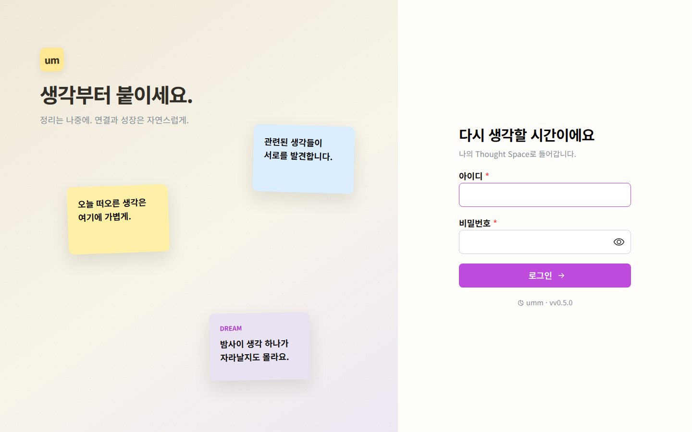
- **로컬 부트스트랩 관리자**: 초기 환경변수(`BOOTSTRAP_ADMIN`, `BOOTSTRAP_ADMIN_PASSWORD`) 기반 보안 로그인
- **Keycloak OIDC SSO**: 설정 시 `Keycloak SSO로 계속` 버튼을 통한 엔터프라이즈 통합 로그인 지원
- **버전 및 서비스명**: 하단에 현재 릴리스 버전(`v0.8.1`)과 서비스명 실시간 표시

---

### 2. 무한 생각 캔버스 (`/space/:spaceId`)
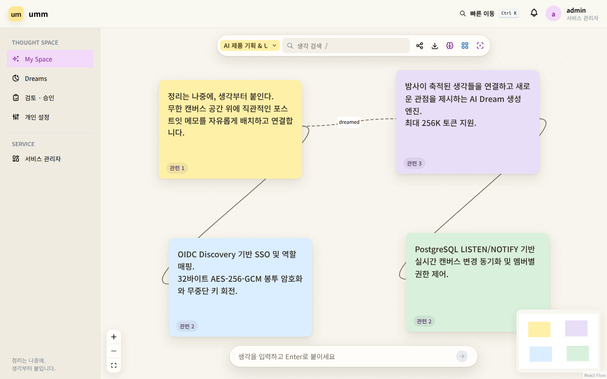
- **Spatial Infinite Canvas**: React Flow 기반의 자유로운 줌(Zoom), 팬(Pan), 미니맵 및 도트 그리드 배경
- **포스트잇 노드 배치**: 더블클릭, `N`, `/` 또는 하단 Quick Capture 바를 통해 공간 어디든 즉시 메모 생성
- **생각 연결선 (Edges)**: 노드 핸들을 드래그하여 생각 간의 관계(관련, Dreamed 등)를 직관적으로 연결
- **실시간 자동 저장**: 저장 버튼 없이 모든 입력, 위치 이동, 크기 변경이 PostgreSQL에 실시간 커밋
- **메모별 AI 제외**: 메모 메뉴에서 민감한 생각을 AI Assist와 Dream 분석 대상에서 제외하고, 외부 호출 직전의 source lease에서도 다시 확인. 외부 임베딩 Gateway에도 본문을 보내지 않고 로컬 vector만 사용

---

### 3. 포스트잇 상세 편집 및 컬러 테마

- **7종 Semantic Pastel Palette**: 노랑(Yellow), 파랑(Blue), 보라(Purple), 라벤더(Lavender), 초록(Green), 빨강(Red), 회색(Gray)
- **리사이즈 & 드래그**: 노드 경계면 리사이저로 크기를 자유롭게 조정하고 드래그하여 배치
- **위치 Undo / Redo**: `Cmd+Z` / `Shift+Cmd+Z` 단축키로 이전 위치 및 이동 이력 복원

---

### 4. 포스트잇 버전 이력 및 복원 (Revisions & Restore)
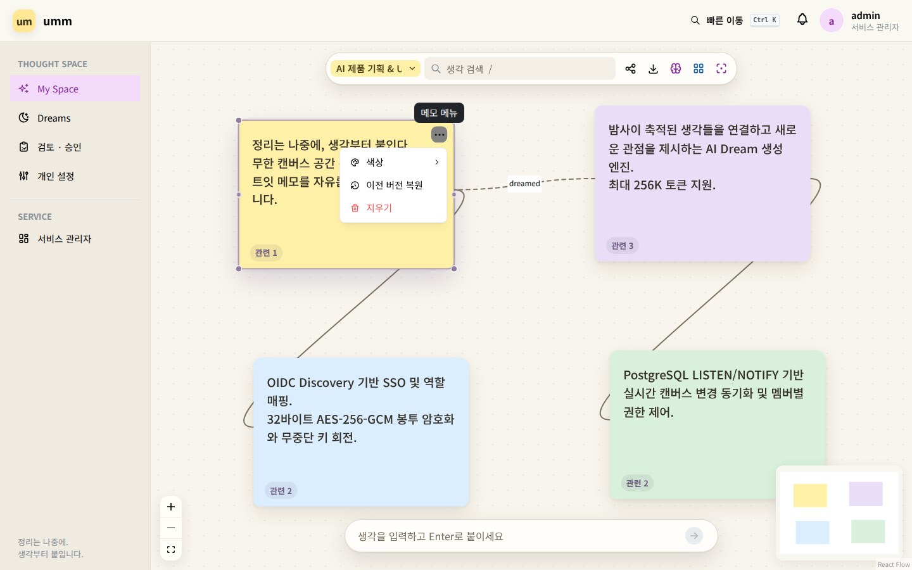
- **버전 스냅샷 자동 생성**: 메모 내용 변경 시마다 백그라운드에서 버전 스냅샷 기록
- **이전 버전 롤백**: 실수로 변경하거나 삭제된 내용을 특정 시점의 버전으로 안전하게 복원

---

### 5. Thought Gravity (생각 인력)
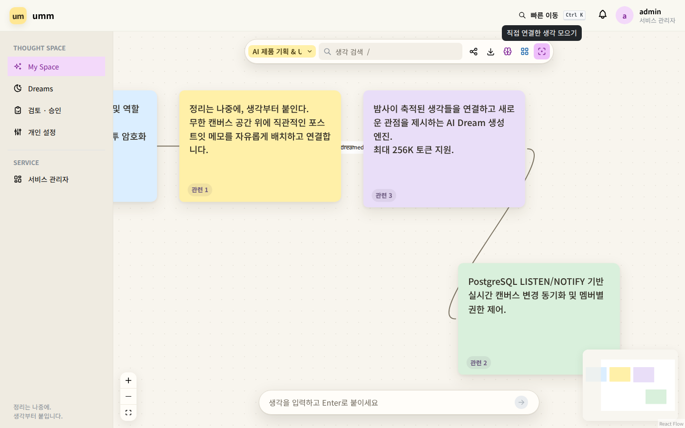
- **원형 궤도 자동 정렬**: 중심 생각을 선택하고 `Thought Gravity` 버튼을 누르면 연결된 모든 관련 생각들이 중심 노드 주위 궤도로 자연스럽게 모임
- **복잡한 캔버스 정리**: 흩어진 아이디어들을 한 번의 클릭으로 주제별로 집결

---

### 6. 공간 관리자 (Space Manager)
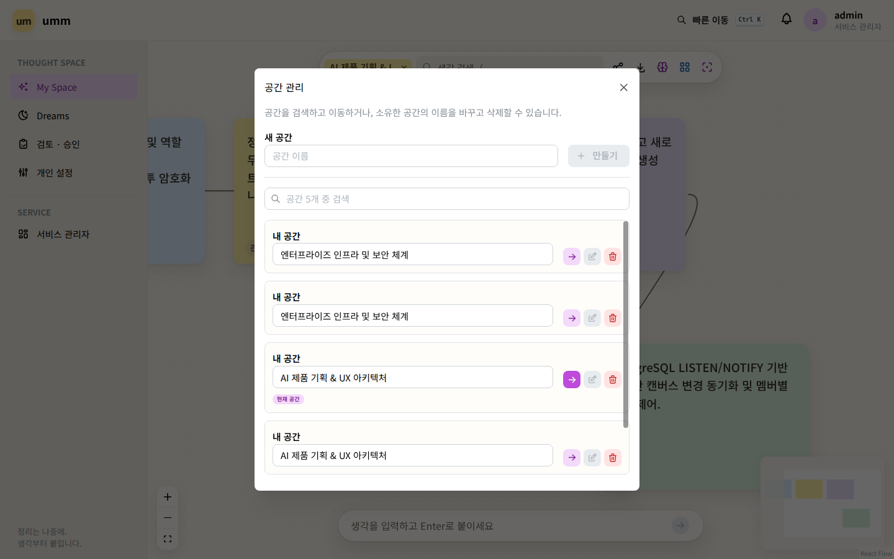
- **공간 생성 (Create Space)**: 새로운 프로젝트 및 생각 주제별 독립 캔버스 생성
- **공간 검색 및 전환**: 등록된 모든 공간을 실시간 검색하고 빠르게 이동
- **공간 이름 변경 및 삭제**: 소유한 공간의 이름을 인라인으로 변경하거나 안전 확인 후 영구 삭제
- **공간별 AI 제외**: 공간 관리에서 전체 공간의 AI Dream 분석을 즉시 켜거나 끄며, 제외 공간의 본문과 해당 공간으로 범위를 제한한 검색어는 외부 임베딩 Gateway에도 전송하지 않음

---

### 7. 공간 협업 및 공유 (Space Collaboration)
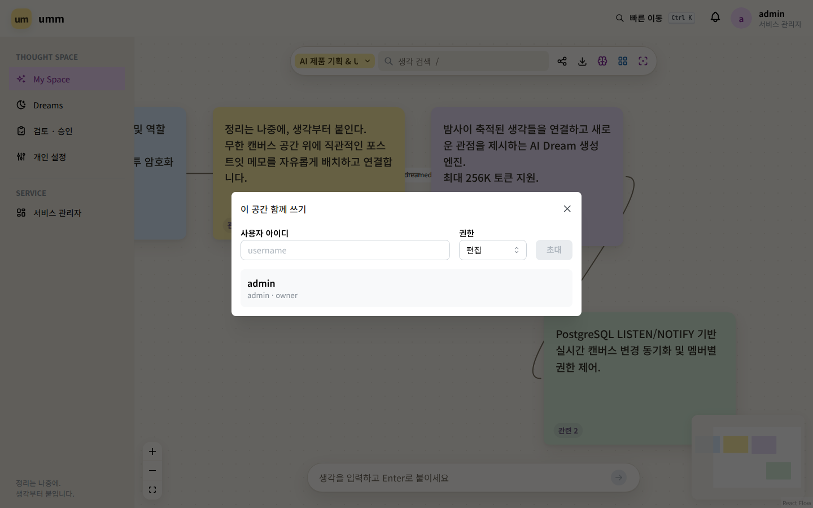
- **팀원 초대**: 사내 사용자를 검색하여 공동 작업 공간으로 초대
- **세분화된 권한 제어**:
  - `보기 (View)`: 메모 조회 및 내보내기만 가능
  - `편집 (Edit)`: 메모 생성, 수정, 연결선 조작 가능
  - `관리 (Manage)`: 멤버 관리 및 공간 설정 제어
- **팀장 승인 연동**: 관리자 검토 정책이 켜져 있을 경우 공간 공유 시 팀장 승인 단계 자동 삽입

---

### 8. Dream 검토함 (`/dreams`)
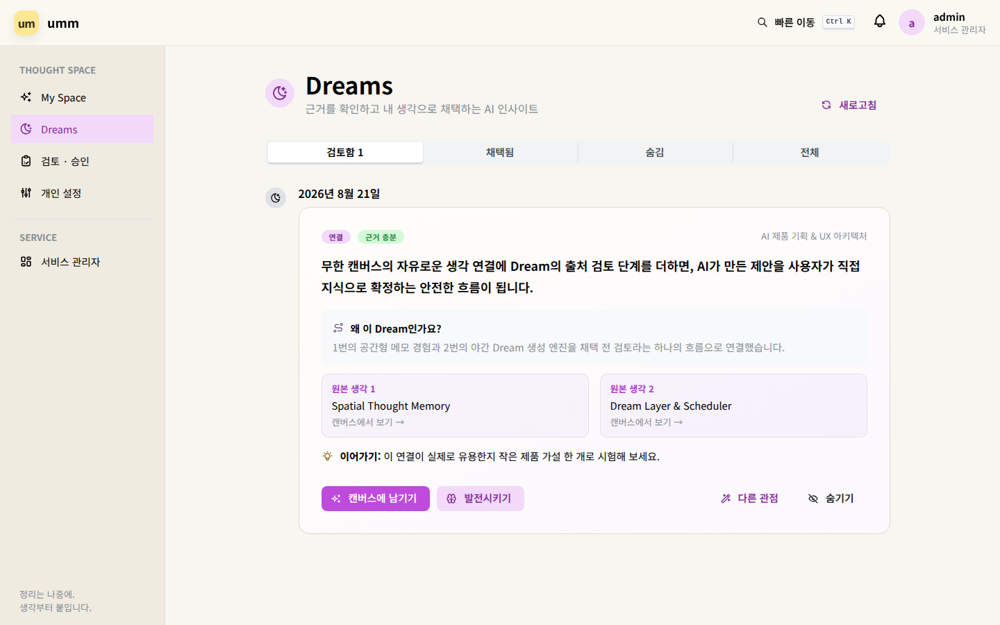
- **채택 전 후보 보관**: Dream Scheduler가 만든 관점은 검토함에 먼저 도착하며, 사용자가 채택하기 전에는 캔버스와 연결선을 변경하지 않음
- **근거와 설명**: 연결/질문/확장 등의 유형, 설명형 품질 배지, 생성 이유, 실제 원본 메모를 함께 표시
- **캔버스 안착**: `캔버스에 남기기`를 누를 때만 라벤더 포스트잇과 원본 생각 연결선을 원자적으로 생성
- **다른 관점과 발전**: 같은 근거로 중복되지 않는 후보를 다시 만들거나 확장/반대 관점/실행 항목으로 발전하며, AI Assist와 자동 생성까지 외부 AI 호출 동안 원본·현재 공유권한을 하나의 접근 lease로 고정. 채택 후 발전 결과도 메모와 연결선을 한 트랜잭션으로 저장
- **정확한 노출·알림 이동**: 카드가 화면에 50% 이상 실제 보일 때만 노출로 집계하고, Dream 도착 알림을 누르면 해당 카드로 바로 이동
- **현재 공유 범위만 표시**: 공유 공간에서 만든 개인 Dream도 현재 owner/member 권한이 있을 때만 Today·검토함에 본문·공간명·원본을 표시하며, 공유가 회수되면 기존 Dream ID의 피드백·채택·재생성·발전을 함께 닫음
- **구체적 피드백**: 뻔함, 무관함, 사실 오류, 반복은 스타일 선호에 반영하고, 과도한 빈도 피드백은 생성 주기를 자동 완화

---

### 9. 개인화 설정 (`/settings`)
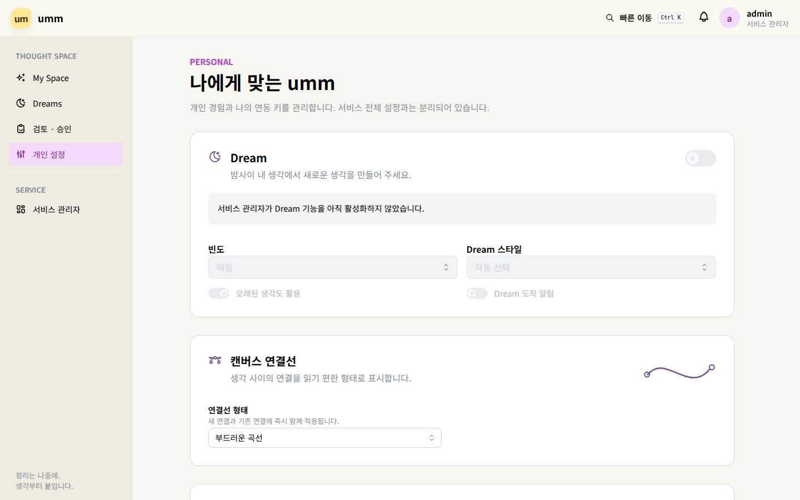
- **Dream 개인화 옵션**:
  - Dream 생성 빈도 (매일, 주 3회, 주 1회)
  - 스타일 선호 (자동, 연결 중심, 질문 중심, 확장 중심, 자유)
  - 오래된 생각 활용 여부 및 Dream 일시 중지 (오늘 / 3일 / 일주일)
- **연결선 형태 선택**: 부드러운 곡선(Bezier), 둥근 꺾은선(Smoothstep), 직선(Straight) 실시간 미리보기 및 변경

---

### 10. 개인 API · MCP 키 관리
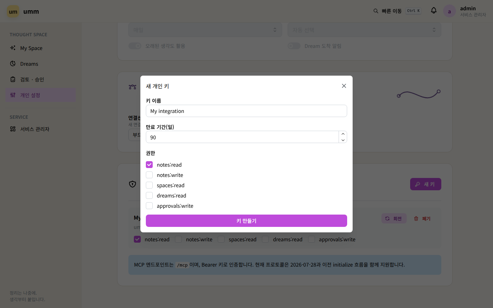
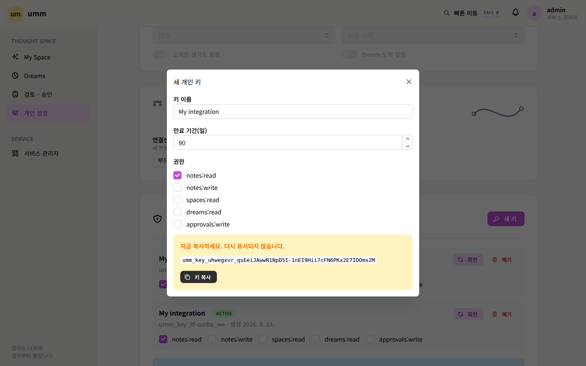
- **최소 권한 Scoped API Key**: 필요한 권한(`spaces:read`, `notes:read`, `notes:write`, `ai:assist` 등)만 선택하여 발급. 외부 Gateway와 AI 쿼터를 쓰는 AI Assist는 `notes:read`와 분리된 `ai:assist`만 허용
- **일회성 Secret 표시**: 발급 시 1회만 노출되는 보안 토큰
- **무중단 키 회전 (Zero-Downtime Rotation)**: 설정된 중첩 시간(예: 24시간) 동안 기존 키와 신규 키를 동시 지원하여 서비스 중단 없는 안전한 키 교체. 보안 난수 생성이 실패하면 새 키나 짧은 대체 키를 저장하지 않고 기존 상태를 그대로 유지

---

### 11. 검토 및 승인 대기열 (`/approvals`)
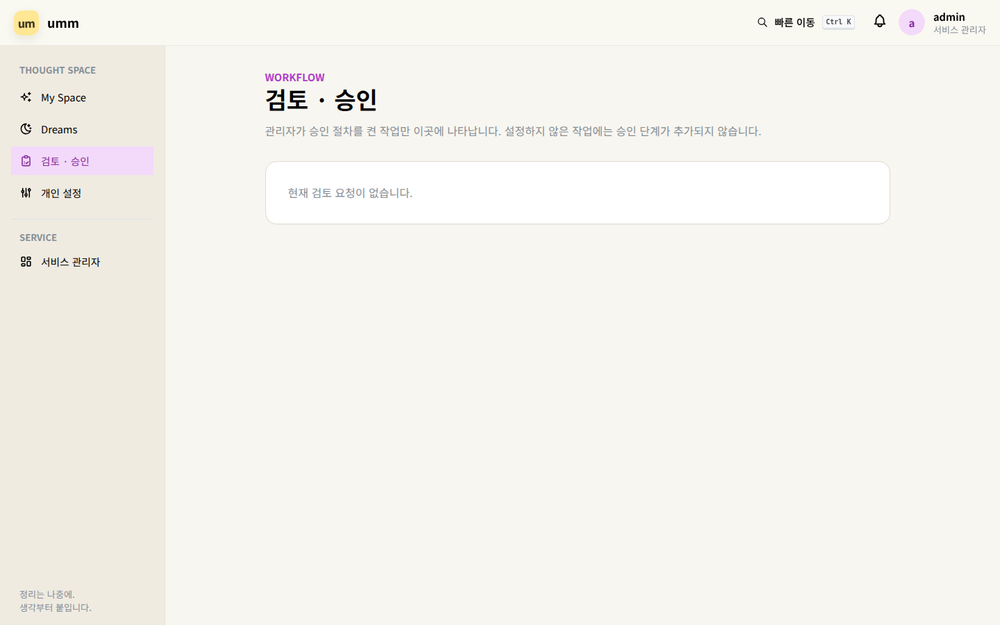
- **작업별 조건부 승인**: 공간 공유 및 외부 내보내기 요청 목록 조회
- **팀장/관리자 결정**: 요청 사유 확인 후 의견(Comment)과 함께 승인(Approve) 또는 반려(Reject) 처리

---

### 12. 서비스 관리자: 운영 현황 (`/admin/overview`)
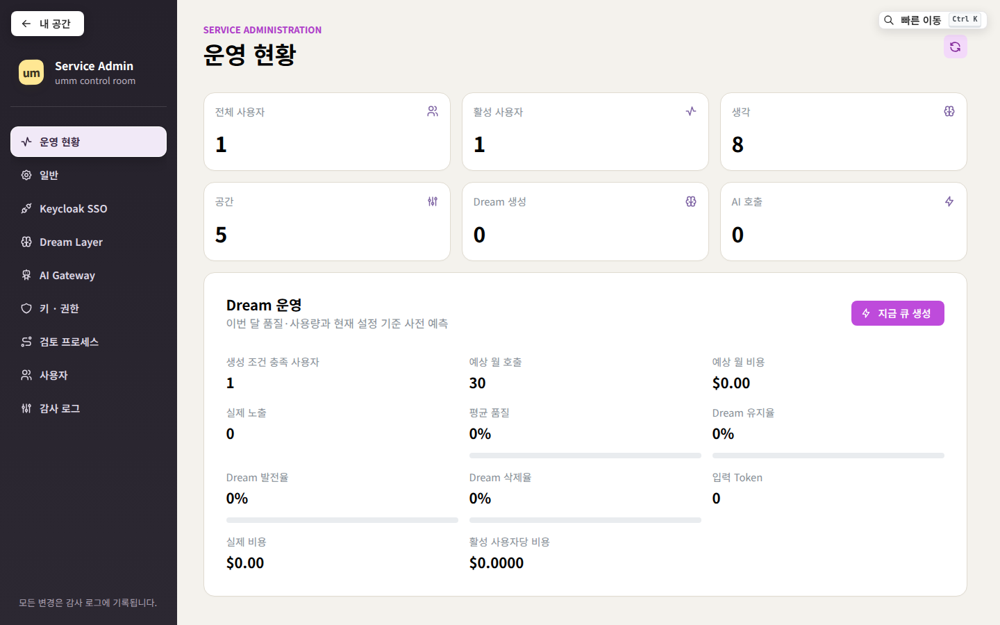
- **KPI 지표 요약**: 전체 사용자, 활성 사용자, 생각 수, 공간 수, Dream 생성 수, AI 호출 수
- **Dream 운영 예측 및 비용 분석**: 예상 월 호출량과 비용, 검토 수, 채택률, 유의미 활용률, 발전/숨김률, 채택 Dream당 비용
- **즉시 큐 생성 (Manual Trigger)**: 야간 스케줄러 대기 없이 즉시 Dream 분석 작업 큐 실행

---

### 13. 서비스 관리자: 일반 설정 (`/admin/general`)
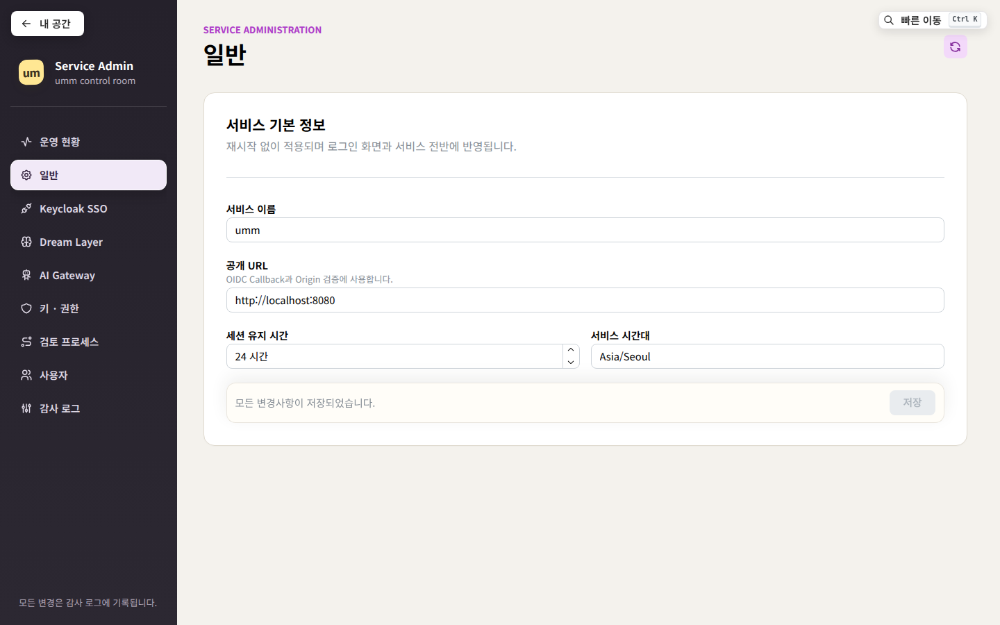
- **서비스 기본 정보**: 서비스 명칭, 공개 URL(Public URL), 세션 유지 시간(1~720시간), 서비스 시간대(IANA Timezone) 구성
- **무중단 즉시 반영**: 서버 재시작 없이 저장 즉시 전체 서비스에 적용

---

### 14. 서비스 관리자: Keycloak SSO (`/admin/oidc`)
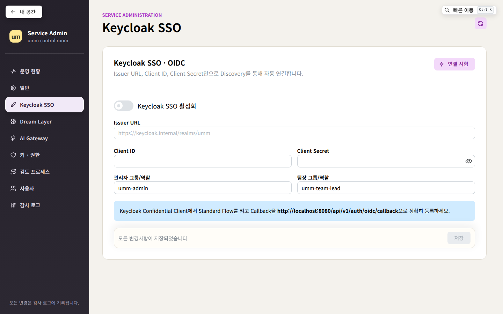
- **OIDC Discovery 자동 연동**: Issuer URL 입력만으로 엔드포인트 자동 탐색
- **암호화 자격증명 보관**: Client Secret을 AES-256-GCM으로 암호화 저장
- **그룹 및 역할 매핑**: 사내 Keycloak 그룹/역할을 umm의 `admin`, `team_lead`, `user`로 자동 매핑
- **원클릭 연결 시험**: 실시간으로 Keycloak 서버와의 OIDC 핸드셰이크 검증

---

### 15. 서비스 관리자: Dream Layer (`/admin/dream`)
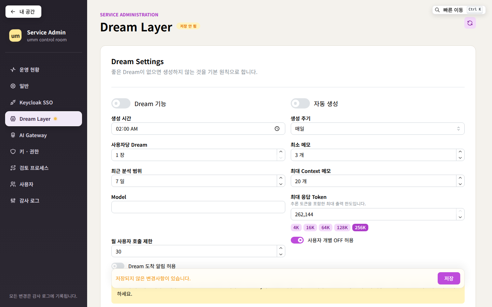
- **스케줄 및 빈도 제어**: 자동 생성 시간(기본 02:00), 주기(매일/평일/주말/요일별/N일 간격)
- **256K Context Window 토큰 한도 제어**: 모델 사양에 맞춰 4K부터 256K까지 토큰 슬라이더 설정
- **품질 기준선(Quality Threshold) & Quiet Mode**: 가치가 높은 경우에만 선별적으로 Dream을 생성하는 Quiet Mode 및 노출 최소 점수 제어

---

### 16. 서비스 관리자: AI Gateway (`/admin/ai_gateway`)
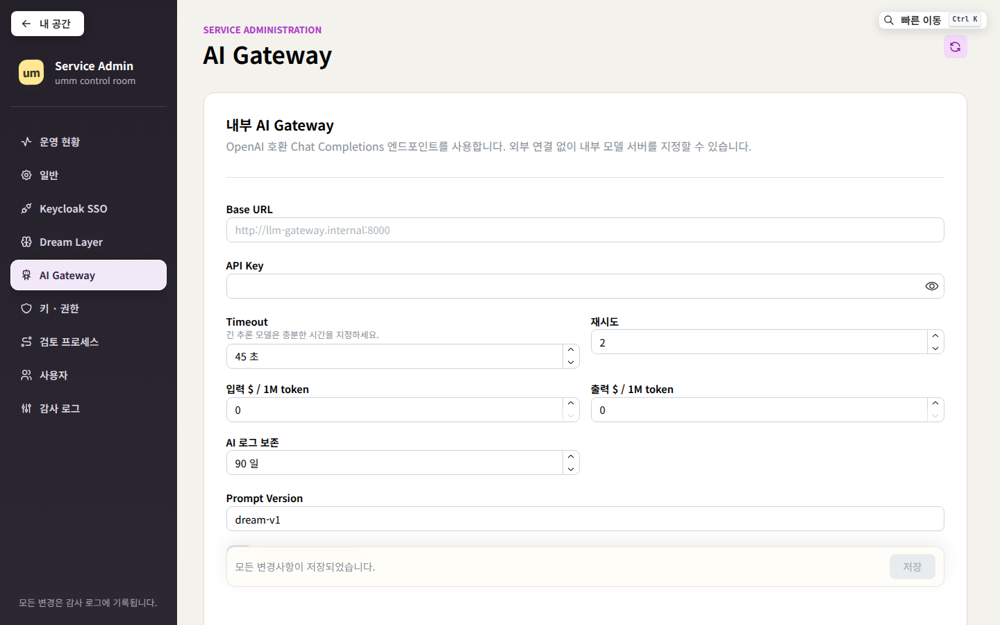
- **내부 OpenAI 호환 Gateway 연동**: Base URL, API Key, Timeout(5~1800초), 재시도 횟수 지정
- **비용 산정 및 데이터 보존**: 토큰당 단가($/1M tokens), AI 로그 보존 주기(기본 90일), 원문 프롬프트 암호화 저장 옵션

---

### 17. 서비스 관리자: 키 · 권한 체계 (`/admin/security`)
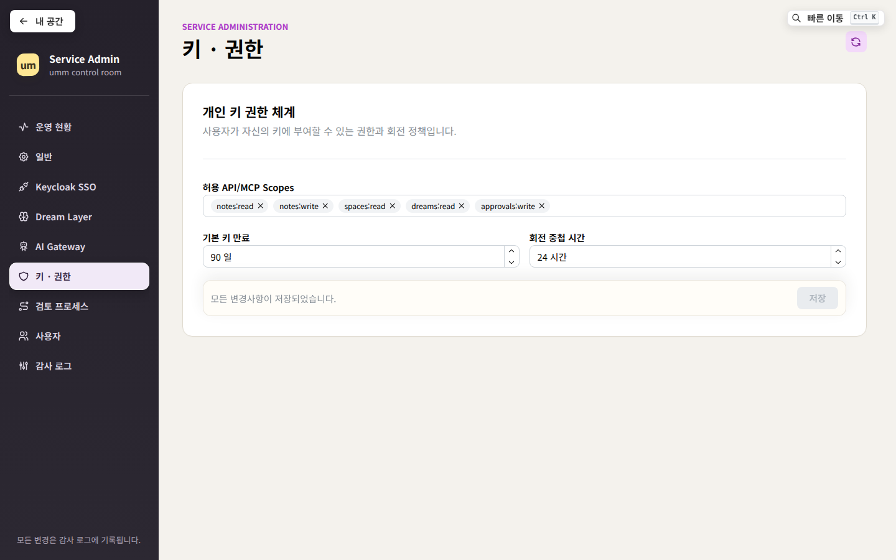
- **허용 API/MCP Scopes 제어**: 일반 사용자가 발급 가능한 권한 태그 화이트리스트 관리
- **키 수명 주기 정책**: 기본 키 유효기간(일) 및 회전 시 중첩 시간(시간) 설정
- **롤링 업그레이드 설정 보존**: 구버전 관리자 화면이 새 로그인·API·AI 한도 필드를 생략해도 최신 저장값에서 생략 항목만 원자적으로 병합하며, 명시한 `0`은 유지하고 `null`은 거부

---

### 18. 서비스 관리자: 검토 프로세스 (`/admin/workflow`)
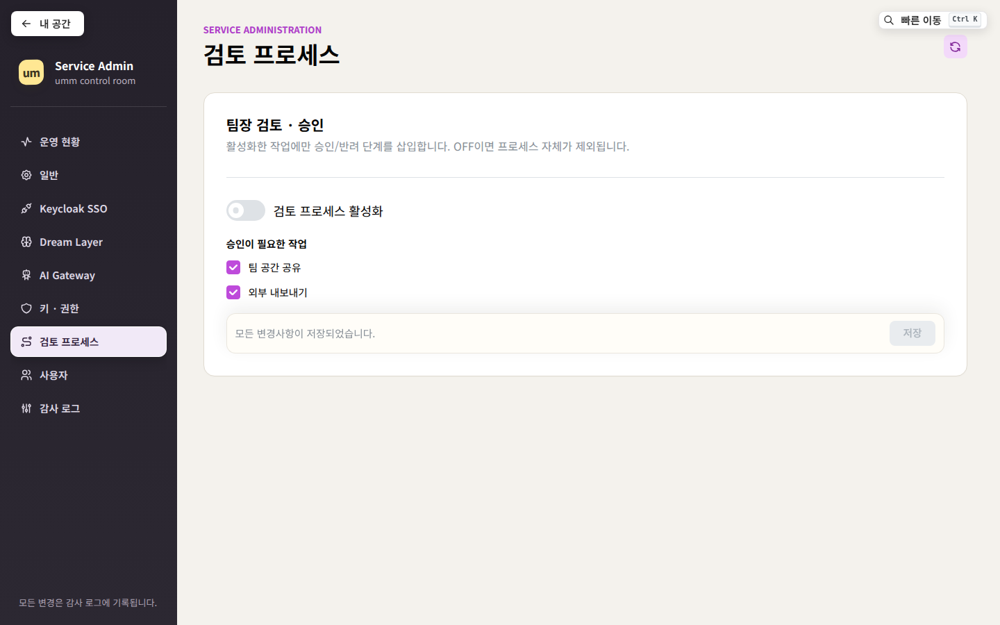
- **작업별 승인 프로세스 On/Off**: 팀 공간 공유, 외부 내보내기 중 승인이 필요한 작업 선택

---

### 19. 서비스 관리자: 사용자 관리 (`/admin/users`)
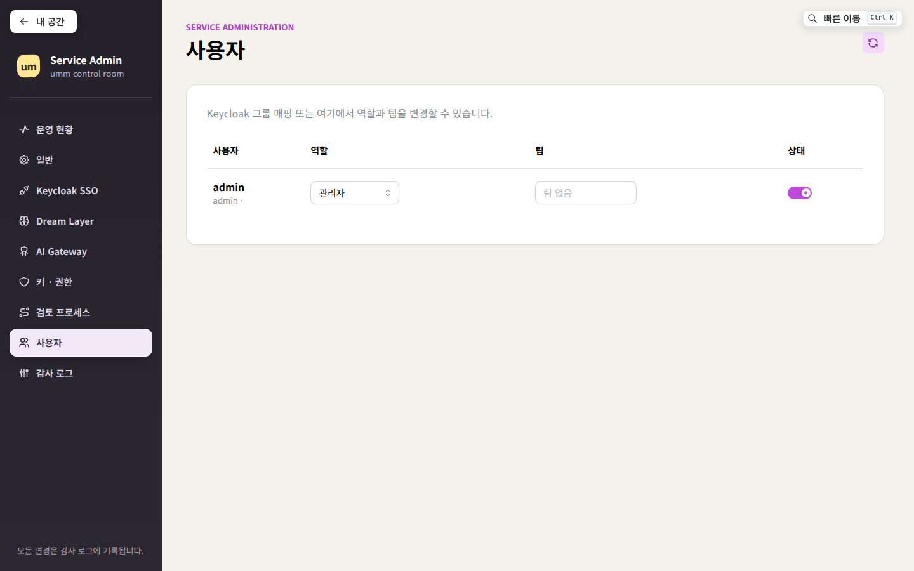
- **사내 계정 통합 관리**: 사용자별 역할(`user`, `team_lead`, `admin`), 소속 팀명, 계정 활성/비활성 스위치 제어

---

### 20. 서비스 관리자: 불변 감사 로그 (`/admin/audit`)
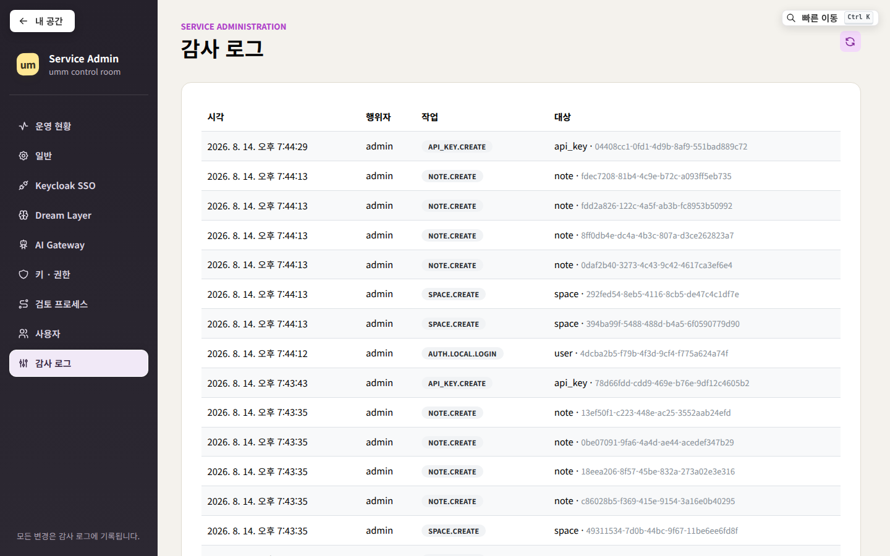
- **추가 전용(Append-only) 감사 추적**: 시각, 행위자, 작업 구분(Action), 대상 리소스(Resource ID)를 위변조 없이 기록

---

### 21. 오늘의 리뷰 (`/today`)

- **집중 검토함**: 다시 볼 날짜가 된 생각, 오래 검토하지 않은 생각, 연결되지 않은 생각, 대기 중인 Dream, 최근 댓글을 한 화면에 모읍니다.
- **맥락형 온보딩**: 공간 생성·생각 작성·연결·Dream 확인 단계가 실제 사용 상태에 따라 자동 완료됩니다.
- **사용자별 다시 보기·고정**: 공유 생각에서도 서로의 상태를 덮어쓰지 않고 검토 완료, 1~365일 미루기, 중요 항목 고정을 관리합니다.
- **독립적인 활동 요약 설정**: 개인 설정에서 “리뷰 요약에 활동 포함”을 꺼도 최근 협업 활동만 숨기며, 고정·기한 도래·오래된 생각의 검토 카드는 그대로 유지합니다.
- **권한·삭제 경계**: 현재 접근 가능한 공간의 삭제되지 않은 생각에 속한 활동만 표시합니다.

### 22. 협업·검색·오프라인 신뢰성

- **하이브리드 검색**: 접근 가능한 전체 메모와 긴 본문 뒤쪽의 키워드 일치를 보존하면서 로컬 의미 유사도를 결합하고 공간·종류·수정 시각 필터, 점수와 추천 이유를 제공합니다.
- **백링크·댓글·멘션**: 실제 연결선 방향을 확인하고 포스트잇 안에서 댓글을 남기며 `@username`으로 공간 멤버를 알립니다. 댓글 작성 transaction은 현재 멤버십을 끝까지 잠그고, 작성자도 현재 공간 접근권한이 있을 때만 자신의 댓글을 삭제할 수 있습니다. 생각이 삭제되면 보관한 댓글 ID로 해결·재개·삭제 이벤트를 만들 수 없고 `comment-mutation-forbidden`으로 종료하며 기존 댓글·멘션 알림도 목록과 unread count에서 숨깁니다.
- **오프라인 큐**: 연결이 끊기면 변경을 장치에 보관하고 다시 연결될 때 멱등 키로 재전송하며, 영구 거부된 요청은 사유를 알리고 그 항목만 제거한 뒤 다음 변경을 계속 처리합니다. 권한 회수 뒤의 댓글 해결·삭제도 terminal type으로 구분해 독립적인 후속 변경을 막지 않습니다. 업그레이드 도중 구버전 탭이 레거시 큐에 늦게 기록한 변경도 기존 계정 큐와 잠금 아래 병합한 뒤 이전 키를 정리하므로 사라지지 않습니다.
- **충돌 병합**: 다른 위치에서 먼저 저장한 버전이 있으면 내 내용과 서버 내용을 나란히 비교해 선택·병합합니다.
- **접근 가능한 대체 보기**: 키보드 화살표 이동, 명확한 focus ring, 최소 터치 영역, reduced-motion, 선형 생각 목록을 지원합니다.

### 23. 개인 서명 웹훅 (`/settings`)

- `note.*`, `comment.*`, `member.*`, `dream.accepted` 등 원하는 이벤트를 HTTPS endpoint로 전달합니다.
- HMAC-SHA256 signing secret은 생성·회전 직후 한 번만 표시합니다.
- 도메인 변경과 PostgreSQL outbox를 원자적으로 커밋해 재시작 뒤에도 이어 보내며, 사설·예약 IP SSRF 차단, 세 번 재시도, 연속 10회 실패 시 자동 중지를 적용합니다. 다국어 오류는 유효한 UTF-8 rune 경계에서 제한해 실패 상태와 자동 중지 횟수를 빠짐없이 기록합니다.
- at-least-once 전달 시도에 대비해 수신 시스템은 delivery UUID를 멱등 처리합니다.
- terminal payload는 즉시 제거하고 delivery metadata는 30일 뒤 정리합니다.

### 24. 관리자 AI 평가·키 회전·관측성

- **AI 평가 세트**: 입력 생각, 기대 단어, 금지 단어로 Dream grounding·품질 회귀를 실행하고 점수·모델·prompt version을 기록합니다.
- **Master-key 회전**: primary/fallback keyring 상태와 회전 대기·읽기 실패를 확인하고 저장된 암호문을 트랜잭션으로 다시 암호화합니다. `enc:` wrapper 이전에 저장된 raw v1 AI prompt도 현재 primary key의 wrapper·v2 형식으로 회전한 뒤에만 pending이 0이 됩니다. OIDC·AI Gateway의 마스킹 설정 저장은 회전과 같은 설정 lock 뒤 최신 secret을 병합해 이전 화면의 동시 저장에도 새 암호문을 보존합니다.
- **운영 지표**: 댓글·온보딩·웹훅 실패·AI eval 결과와 HTTP request/latency를 관리 화면 및 Prometheus에서 확인합니다.

### 25. 언어 · 테마 · 가져오기 (v0.8.0)

- **한국어 / English**: 프로필 메뉴에서 언어를 바꾸면 화면 전체가 즉시 전환됩니다. 선택은 계정에 저장되어 다른 브라우저에서도 이어집니다. 언어·테마 부분 저장이 동시에 겹쳐도 각 선택을 원자적으로 합쳐 서로 되돌리지 않습니다. 번역이 없는 문구는 한국어 원문으로 표시되므로 화면이 비어 보이는 일이 없습니다.
- **밝게 / 어둡게 / 시스템 설정**: 로그인하면 계정의 테마를 현재 탭의 활성 theme provider에 즉시 적용하고, 시스템 설정은 자동 모드로 복원합니다. 첫 페인트 전에 테마가 결정되어 어두운 화면으로 들어올 때 흰 화면이 번쩍이지 않으며, 포스트잇은 두 테마에서 모두 종이색을 유지합니다.
- **마크다운 가져오기**: 내보내기 메뉴에서 마크다운 파일이나 붙여넣은 텍스트를 `#` 제목·`---` 구분선·빈 줄 기준으로 나눠 각각 하나의 생각으로 캔버스에 붙입니다(한 번에 최대 200개). 200개를 넘으면 실제 개수를 안내하고 가져오기를 시작하지 않으므로 201번째 이후 원문도 편집기에 그대로 남습니다. 부분 실패 시 성공 항목은 유지하고 실패 항목만 편집기에 남겨 다시 시도합니다.
- **모바일 공유 타깃과 안전한 앱 셸**: 설치형 PWA로 추가하면 다른 앱의 공유 시트에 umm이 나타나고, 공유한 내용이 빠른 입력창에 채워집니다. 서비스 워커는 HTML 탐색 응답만 오프라인 앱 셸로 갱신해 manifest·asset JSON·아이콘을 직접 열어도 다음 오프라인 화면이 해당 정적 파일로 바뀌지 않습니다. Content hash가 붙은 bundle만 장기 immutable로 캐시하고 고정 manifest·service worker·아이콘은 재검증해 새 릴리스의 바로가기와 앱 메타데이터를 오래된 값으로 고정하지 않습니다.
- **키보드 편집**: 캔버스에서 `Tab`으로 생각 사이를 이동하고 `Enter`로 편집을 시작하며 `Esc`로 빠져나옵니다.

### 26. 규모와 남용 방지 (v0.8.0)

- **푸시 기반 실시간 협업**: 공간을 열어 둔 사람마다 초당 폴링하던 구조를 PostgreSQL `LISTEN/NOTIFY` 팬아웃으로 바꿨습니다. 유휴 상태의 데이터베이스 비용이 0이고, 변경은 즉시 도착합니다. 상한 1~2의 작은 pool에서는 모든 연결을 request에 남기도록 전용 listener를 끄고 1초 안전 폴링으로 자동 전환하며, 상한 3부터 두 request 연결을 남긴 채 listener를 시작합니다. 실행 중 listener가 끊기거나 복구되면 상태 전환이 열린 SSE를 즉시 깨워 긴 safety deadline을 기다리지 않고 폴링 주기를 다시 맞춥니다.
- **인덱스를 타는 검색**: 키워드 조건을 `pg_trgm` GIN 인덱스가 사용될 수 있는 형태로 다시 작성했습니다.
- **선택적 게이트웨이 임베딩**: 관리자가 임베딩 모델을 지정하면 의미 검색 품질이 올라가고, 비워 두면 지금까지처럼 완전 오프라인으로 동작합니다. 모델명과 Gateway endpoint fingerprint를 함께 벡터 공간으로 식별해 같은 모델명을 쓰는 제공자로 주소를 바꿔도 기존 벡터를 점진적으로 다시 만듭니다. 설정 변경 전에 시작한 원격 응답과 장애 뒤의 전체 로컬 정규화 pass는 새 Gateway 벡터를 덮어쓰지 못합니다. 원격 장애나 한 batch 안의 vector 차원 불일치 시에는 비교 집합 전체를 한 로컬 벡터 공간으로 맞추고 5분 회로 차단으로 반복 timeout을 피합니다. 임베딩과 Dream Gateway의 오류 본문 일부는 다국어 rune를 쪼개지 않고 제한해 관리자 오류 응답과 로그가 항상 유효한 UTF-8을 유지합니다.
- **로그인 잠금과 요청 한도**: 인스턴스 간에 공유되는 로그인 잠금, 호출자별 API 한도, AI 생성의 분당·하루 한도를 관리자 화면에서 조정합니다. 같은 주소·계정의 비밀번호 검증과 실패 기록을 하나의 PostgreSQL 임계 구역에서 처리해 병렬 요청도 설정한 추측 횟수를 넘지 않습니다.
- **로그인한 기기**: 개인 설정에서 다른 로그인을 확인하고 즉시 종료할 수 있습니다.
- **응답별 CSP nonce**: 스크립트 실행을 응답마다 새로 만드는 nonce로 고정해, 주입된 스크립트가 같은 출처를 가리켜도 실행되지 않습니다.
